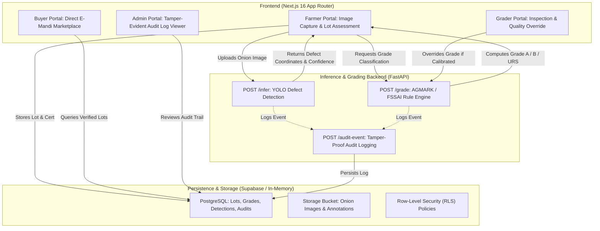

# 🧅 Onion Quality Assessment & Grading System (MH ONION)

An AI-powered agricultural quality grading, defect analysis, and transparent traceability platform aligned with **AGMARK** and **FSSAI** standards for Maharashtra APMC Mandis and farmers.

---

## 🏛 System Architecture



---

## ✨ Key Features

- **🌾 Farmer Direct Portal**:
  - Smartphone camera image capture with live preview.
  - Automated defect pinpoints (sprouted, damaged, rotten, undersized) mapped directly on the image.
  - Instant AGMARK Grade Certificate generation (**Grade A**, **Grade B**, **URS**).
  - One-click listing to the E-Mandi marketplace with transparent pricing.

- **🔍 APMC Grader Portal**:
  - Official lot verification interface.
  - Authorized quality override with calibrated notes and reason tracking.
  - Direct sync to tamper-evident audit trail.

- **🛒 Wholesale Buyer Marketplace**:
  - Search and filter lots by AGMARK grade, location, and price.
  - Verified quality certificates and defect breakdowns before purchase.
  - Direct trade bidding and checkout workflow.

- **🛡️ Admin & Tamper-Evident Audit Trail**:
  - Real-time logging of all lot assessments, AI detections, grade generations, and manual overrides.
  - Immutable audit logs with timestamp, actor role, and entity reference.

---

## 🛠 Tech Stack

| Layer | Technologies |
|---|---|
| **Frontend** | Next.js 16 (App Router), React 19, TypeScript, Tailwind CSS, Lucide Icons |
| **Backend Service** | Python 3.11+, FastAPI, Ultralytics YOLO, PyTest, Uvicorn |
| **Database & Auth** | Supabase (PostgreSQL), Row-Level Security (RLS), Supabase Storage |

---

## 📁 Repository Structure

```
├── web/                     # Next.js 16 Web Application
│   ├── src/
│   │   ├── app/             # App Router pages (farmer, grader, buyer, admin, marketplace)
│   │   ├── components/      # UI components (Navbar, etc.)
│   │   ├── lib/             # Supabase & client utilities
│   │   ├── types/           # TypeScript database models and interfaces
│   │   └── middleware.ts    # Role-based access control middleware
│   ├── public/              # Static assets and sample images
│   └── package.json
│
├── service/                 # Python FastAPI AI Backend
│   ├── grading/             # AGMARK / FSSAI rule engine
│   ├── models/              # YOLO detector wrappers & weights
│   ├── tests/               # PyTest test suite
│   ├── audit.py             # Tamper-evident audit logging logic
│   ├── main.py              # FastAPI endpoints & CORS config
│   ├── requirements.txt
│   └── seed.py              # Demo database seeder
│
└── supabase/                # Database Migrations & RLS Policies
    └── migrations/          # PostgreSQL schema definitions
```

---

## 🚀 Quick Start Guide

### 1. Prerequisites
- **Node.js** v18+ (v20+ recommended)
- **Python** 3.11+
- **Git**

---

### 2. Setup & Start Backend (FastAPI)

```bash
cd service
python -m venv venv

# Windows:
.\venv\Scripts\activate
# macOS/Linux:
# source venv/bin/activate

pip install -r requirements.txt
uvicorn main:app --reload --port 8000
```

- API Docs: `http://localhost:8000/docs`

---

### 3. Setup & Start Frontend (Next.js)

```bash
cd web
npm install
npm run dev
```

- Web App: `http://localhost:3000`

---

### 4. Running Backend Tests

```bash
cd service
python -m pytest
```

---

## 📋 Standard AGMARK Grading Criteria

| Defect Class | Grade A (Export Quality) | Grade B (Domestic Market) | URS (Reject / Process) |
|---|---|---|---|
| **Rotten / Decay** | 0% | ≤ 3% | > 3% |
| **Sprouted** | ≤ 2% | ≤ 5% | > 5% |
| **Damaged / Cut** | ≤ 3% | ≤ 7% | > 7% |
| **Undersized (<35mm)** | ≤ 5% | ≤ 10% | > 10% |
| **Minimum Healthy** | **≥ 90%** | **≥ 75%** | **< 75%** |
